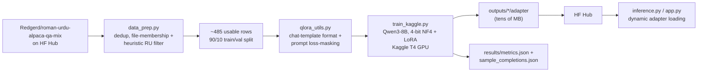
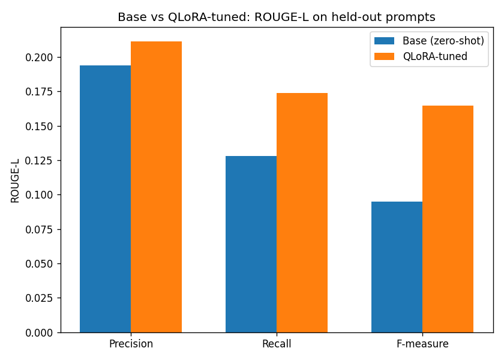
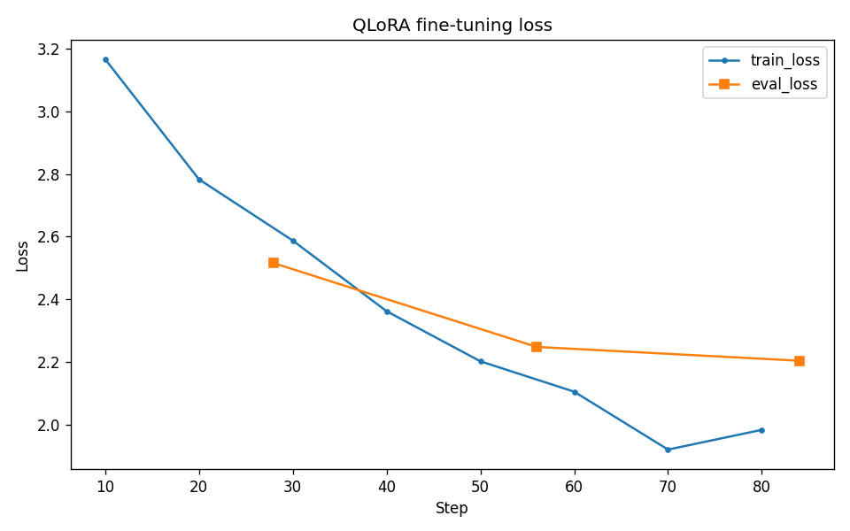

<div align="center">

# Roman Urdu QLoRA Assistant

*Teaching an 8B open-weight LLM to default to Roman Urdu — 4-bit QLoRA fine-tuning on a single free Kaggle GPU, with the real wins **and** the real failure modes reported.*


[](https://huggingface.co/Qwen/Qwen3-8B)
[](https://huggingface.co/code-aitazaz/roman-urdu-qlora-qwen3-8b)
[](https://huggingface.co/datasets/Redgerd/roman-urdu-alpaca-qa-mix)

</div>

<br>

| | |
|---|---|
| **Base model** | [`Qwen/Qwen3-8B`](https://huggingface.co/Qwen/Qwen3-8B) (Apache-2.0) |
| **Method** | 4-bit QLoRA — rank 16, all 7 linear projections |
| **Training data** | 485 real Roman Urdu instruction pairs — after finding & fixing a genuine duplication bug in the source dataset |
| **Compute** | 1× Kaggle T4 (free tier), ~1 hour end to end |
| **Headline result** | ROUGE-L F-measure **0.164 vs. 0.095** zero-shot base (**+73%** relative) |
| **Honest caveat** | Reliably switches to Roman Urdu; longer generations can loop — see [Results](#results) |
| **Try it** | [Adapter on the Hub](https://huggingface.co/code-aitazaz/roman-urdu-qlora-qwen3-8b) — loadable with no local training |

## Contents

[Overview](#overview) · [Data quality](#data-quality) · [Approach](#approach) · [Model on the Hub](#model-on-the-hugging-face-hub) · [Pipeline](#pipeline) · [Repo layout](#repo-layout) · [Setup](#setup) · [Running it](#running-it) · [Results](#results) · [License](#license)

## Overview

This adapter steers an already-capable multilingual instruction-tuned base
model to respond fluently and consistently in **Roman Urdu** (Urdu written in
Latin script). It's **style/behavior adaptation, not knowledge injection**:
the real, usable training set is ~485 examples — style-adaptation scale, not
enough to teach a model Urdu from scratch. Qwen3-8B's own pretraining already
covers Urdu-adjacent multilingual text; QLoRA's job here is to make it
*default* to answering in Roman Urdu, not to teach it the language.

Unlike the other two projects in this portfolio, the code and a fully
self-contained, pedagogically-commented Kaggle notebook were built for the
user to run and watch themselves — and they did. Every number and every
transcript in [Results](#results) below is from that real run, not a
placeholder.

## Data quality

<details>
<summary><b>A real duplication bug was found and fixed in the upstream dataset — click for the full writeup</b></summary>

<br>

`Redgerd/roman-urdu-alpaca-qa-mix`'s Hub `train` split (1,489 rows) is
actually two raw JSONL files concatenated: `combined_roman_urdu_english.jsonl`
(1,000 rows: ~500 Roman Urdu + ~500 English Alpaca, shuffled together) and
`roman_urdu_QA_full_alpaca.jsonl` (489 rows: the pure-Roman-Urdu source the
combined file's Roman-Urdu half was drawn from) — confirmed by downloading
both raw files and diffing them against the Hub's auto-converted parquet
byte-for-byte.

**488 of those 489 "full" rows are exact-content duplicates of rows already
inside `combined`.** The naive 1,489-row split silently double-counts ~488
examples. There's also no language-tag column (parquet columns are only
`instruction`/`input`/`output`/`text`), so `src/data_prep.py` isolates the
real Roman-Urdu rows using two independent signals that have to agree:

1. **File membership** — does this row's `(instruction, input, output)` match
   a row in the raw `roman_urdu_QA_full_alpaca.jsonl` source file?
2. **A lightweight Roman-Urdu stopword-hit-rate heuristic**, as a cross-check.

Cross-validating the two found only 3 disagreements out of 999 deduped rows —
all the same failure mode: English-language *questions about* Urdu (e.g.
"Give some examples of Singular and Plural in Urdu Language") that happen to
live inside the "pure Roman-Urdu" source file. Those 3 are dropped.

**Net usable pool: ~485 Roman-Urdu rows** (raw 1,489 → 999 deduped → 488
file-matched → 485 after the heuristic cross-check). `data_prep.py` prints
this whole funnel when you run it. Also worth noting: the 489-row source file
itself contains exactly one internal duplicate.

A larger Urdu-*script* (not Roman) Alpaca-52K translation exists —
[`saillab/alpaca-urdu-cleaned`](https://huggingface.co/datasets/saillab/alpaca-urdu-cleaned),
CC-BY-NC academic-only — but transliterating it to Roman Urdu at scale is real
engineering effort with real quality risk, and is **not implemented here**;
it's a documented future-augmentation idea, not a v1 feature.

</details>

## Approach

<details open>
<summary><b>Model, quantization, LoRA, training, and evaluation design — click to collapse</b></summary>

<br>

- **Base model**: [`Qwen/Qwen3-8B`](https://huggingface.co/Qwen/Qwen3-8B) —
  Apache-2.0, already instruction/chat-tuned, dense (not MoE) transformer
  architecture with a multilingual tokenizer. Its chat template supports an
  `enable_thinking` toggle for extended reasoning traces; this project uses
  `enable_thinking=False` throughout (training *and* inference) for
  straightforward single-turn instruction-following, not chain-of-thought.
- **Method**: 4-bit QLoRA. `BitsAndBytesConfig(load_in_4bit=True,
  bnb_4bit_quant_type="nf4", bnb_4bit_use_double_quant=True,
  bnb_4bit_compute_dtype=torch.float16)` — **float16, not bfloat16**: a Kaggle
  T4 is a Turing GPU (compute capability 7.5), and bf16 tensor-core support
  only starts at Ampere (cc 8.0). Most QLoRA recipes default to bf16 because
  they assume A100-class hardware; on a T4 that either silently falls back to
  slow emulated math or mismatches the Trainer's fp16 mixed-precision mode.
  Paired with `TrainingArguments(fp16=True)`.
- **LoRA config**: rank 16, alpha 32, dropout 0.05, targeting all 7 linear
  projections (`q_proj, k_proj, v_proj, o_proj, gate_proj, up_proj,
  down_proj`) — not just attention. The QLoRA paper found this is needed to
  match full-finetune quality, and it's essentially free here: ~44M trainable
  params, about 0.5% of the 8B total. (Qwen3's `q_norm`/`k_norm` QK-norm
  layers are `RMSNorm`, not `Linear`, so they're correctly excluded by
  `peft`'s target-module matching automatically.)
- **Training loop**: plain `transformers.Trainer` with a small custom
  collator (`qlora_utils.SFTDataCollator`, `qlora_utils.format_and_mask`) —
  not `trl.SFTTrainer`. This repo already has a precedent for a small custom
  `Trainer` subclass when there's a specific need (the sibling project's
  `WeightedLossTrainer`), and hand-writing the prompt-masking logic keeps the
  mechanics visible and teachable in the notebook, rather than hidden inside
  a library call — worth it for a notebook meant to be read, not just run.
  Verified (by tokenizing all 488 real Roman-Urdu examples both ways and
  diffing token ids) that the masked prompt is byte-identical to the prefix
  of the full labeled sequence, so training-time masking and inference-time
  prompting use exactly the same tokens.
- **Sequence length**: 512. Measured (not guessed) by tokenizing every real
  example through the actual chat template: min 42 / p50 325 / p90 351 / p99
  369 / max 374 tokens — 512 gives headroom without wasting compute on padding.
- **`prepare_model_for_kbit_training`** is called before attaching LoRA — the
  standard, necessary glue step when combining 4-bit loading with gradient
  checkpointing (enables `requires_grad` on the input embeddings, casts norms
  to fp32). Skipping it is a well-known QLoRA gotcha
  (`element 0 of tensors does not require grad`).
- **Evaluation**: generate on held-out prompts both with and without the
  adapter, via `peft`'s `disable_adapter()` context manager on the *same*
  loaded model — avoids loading two full 8B copies, which wouldn't fit
  together on a 16GB T4 anyway. Scored with ROUGE-L
  (`rouge_score`, `use_stemmer=False` — the default English Porter stemmer
  would mangle Roman-Urdu tokens). A single scalar undersells a ~485-example
  result, so `evaluate.py` also saves full instruction/reference/base/tuned
  transcripts for qualitative reading, not just `results/metrics.json`.
- **Charts**: the notebook plots and saves a training loss curve
  (`results/training_loss.png`) and a base-vs-tuned ROUGE-L bar chart
  (`results/rouge_comparison.png`), rendered inline as you watch it run.
  The plotting code detects whether it's actually running inside a notebook
  kernel and only calls `plt.show()` there, forcing the non-interactive Agg
  backend otherwise — a plain script run (`train_qlora.py`/`evaluate.py`) on
  a headless machine can otherwise auto-select an interactive matplotlib
  backend that opens a real window and blocks forever waiting for someone to
  close it (hit this directly while building — a script hung, not just ran
  slow, until this was fixed).
- **Inference**: the LoRA adapter is loaded dynamically on top of the 4-bit
  base (`peft.PeftModel.from_pretrained`), not merged. Merging a LoRA delta
  into a 4-bit-quantized base isn't a clean operation — it needs dequantizing
  to fp16 first, producing a second ~16GB artifact. Dynamic loading keeps the
  shareable artifact tiny (the adapter alone, tens of MB) and uses the exact
  same quantization path at inference as at training.
- **The local CPU smoke test's honest scope**: `bitsandbytes`'s 4-bit path is
  CUDA-only, and there's no GPU on the dev machine this was built on.
  `scripts/smoke_test.py` validates the data pipeline, chat-template
  formatting, loss masking, and LoRA adapter attachment against a tiny
  random-weight Qwen3-architecture model in full precision on CPU — it does
  **not**, and cannot, validate the real 4-bit quantized path. That can only
  be exercised on a real CUDA machine, which is exactly what
  `kaggle/train_kernel.ipynb` is for.

</details>

## Model on the Hugging Face Hub

The trained adapter is public and loadable directly (no local training or
Kaggle run required):
[`code-aitazaz/roman-urdu-qlora-qwen3-8b`](https://huggingface.co/code-aitazaz/roman-urdu-qlora-qwen3-8b) —
its model card includes a full usage snippet and the same honest
results/limitations writeup as below.

```python
from peft import PeftModel
from transformers import AutoModelForCausalLM

base = AutoModelForCausalLM.from_pretrained("Qwen/Qwen3-8B", quantization_config=..., device_map="auto")
model = PeftModel.from_pretrained(base, "code-aitazaz/roman-urdu-qlora-qwen3-8b")
```

## Pipeline



## Repo layout

```
src/
  data_prep.py         # load + dedup + Roman-Urdu-filter the instruction data, build splits
  qlora_utils.py          # BitsAndBytesConfig/LoraConfig builders, chat-template formatting + loss masking, generation helper
  metrics_utils.py           # ROUGE-L scoring, shared by evaluate.py and the Kaggle notebook
  train_qlora.py                # local entry point (+ --smoke-test); real runs need CUDA
  train_kaggle.py                  # end-to-end GPU driver, section-marked, inlined into the Kaggle notebook
  evaluate.py                        # base-vs-tuned generation + ROUGE-L, writes results/*.json
  inference.py                         # single-prompt generation wrapper used by the demo app
kaggle/
  kernel-metadata.json                   # Kaggle kernel config (GPU T4, internet on)
  train_kernel.ipynb                       # auto-generated, pedagogically cell-split -- see scripts/build_kaggle_notebook.py
app/
  app.py                                     # Gradio demo (needs CUDA to actually run)
scripts/
  smoke_test.py                                 # local CPU pipeline sanity check
  build_kaggle_notebook.py                         # regenerates kaggle/train_kernel.ipynb from src/
results/
  metrics.json, sample_completions.json              # real numbers from an actual Kaggle T4 run
  training_loss.png, rouge_comparison.png              # charts from that same run
```

## Setup

```bash
python -m venv .venv
.venv\Scripts\activate        # Windows
pip install -r requirements.txt
```

`bitsandbytes` needs CUDA to do anything useful — it'll install fine on a
CPU-only machine, but the 4-bit quantized path simply won't run there. That's
expected; see "Running it" below.

## Running it

**1. Prepare data:**

```bash
python src/data_prep.py
```

Prints the full filtering funnel described in [Data quality](#data-quality) above.

**2. Sanity-check the pipeline locally (CPU, no GPU needed):**

```bash
python scripts/smoke_test.py
```

Validates everything except the real 4-bit quantization path — see the
"local CPU smoke test's honest scope" note in [Approach](#approach).

**3. Fine-tune on Kaggle's free T4 GPU:**

```bash
python scripts/build_kaggle_notebook.py   # regenerate kaggle/train_kernel.ipynb if you changed src/
```

Then either:
- Open `kaggle/train_kernel.ipynb` directly on kaggle.com (upload it, or
  create a new notebook and paste it in), set **Settings → Accelerator → GPU
  T4 x1** and **Internet → On**, and **Run All** — read the markdown between
  cells as it goes; the notebook is written to be watched, not just executed
  blind. The last cell prints several instruction / reference / base-model /
  tuned-model transcripts side by side so you can see the adapter's effect
  immediately.
- Or push it via the Kaggle CLI, same mechanism the sibling projects use
  (entirely optional, just a faster way to get the notebook onto Kaggle):
  ```bash
  cd kaggle
  kaggle kernels push --accelerator NvidiaTeslaT4
  kaggle kernels output <username>/roman-urdu-qlora-assistant-training -p ../kaggle_output
  ```

**4. Evaluate a trained adapter (needs CUDA):**

```bash
python src/evaluate.py --adapter-dir code-aitazaz/roman-urdu-qlora-qwen3-8b
# or a local path: --adapter-dir kaggle_output/outputs/qwen3-8b-roman-urdu-qlora
```

**5. Run the demo (needs CUDA):**

```bash
python app/app.py --adapter-dir code-aitazaz/roman-urdu-qlora-qwen3-8b
```

Both accept a local path or a Hub repo id interchangeably (`peft` resolves
either transparently) — the trained adapter is public on the Hub, so neither
command actually needs the local `kaggle_output/` folder or your own Kaggle
run to work, as long as you have a CUDA machine to run them on.

## Results

Real numbers from an actual Kaggle T4 run (3 epochs, 438 train / 48 val rows,
ROUGE-L on 40 held-out prompts — see `results/metrics.json` for the raw
numbers and `results/sample_completions.json` for all 8 saved transcripts).

| Model | ROUGE-L Precision | ROUGE-L Recall | ROUGE-L F-measure |
|---|:-:|:-:|:-:|
| Base (zero-shot) | 0.194 | 0.128 | 0.095 |
| **QLoRA-tuned** | **0.211** | **0.174** | **0.164** |

<table>
<tr>
<td width="50%"></td>
<td width="50%"></td>
</tr>
</table>

QLoRA-tuned wins on all three, and by a wide margin on recall/F-measure
(+73% relative F-measure). Loss dropped steadily and smoothly over the full
run (3.17 → ~1.95 train loss across 84 steps, eval loss tracking it down
too) — no sign of the eval loss curve turning back up, so this isn't a
textbook overfitting-on-the-loss-curve story.

> **But the qualitative transcripts tell a more honest, more interesting
> story than the scalar table above.** Reading all 8 saved examples:

- **The adapter reliably does the one thing it was supposed to do**: base
  zero-shot frequently answers Roman-Urdu prompts *in English*, or produces
  garbled Urdu-script output, or just misunderstands the question (one
  example: asked to explain Adam Smith's "invisible hand" in Urdu, base
  free-associates about "the Battle of the Bulge... during World War I").
  QLoRA-tuned answers in Roman Urdu, on-topic, every single time. That's a
  real, working style adaptation — the actual thing this project set out to do.
- **But several QLoRA-tuned completions degrade into repetition loops** —
  e.g. one asked for a klasiki ghazal produces "Kabhi na kahin kisi ne kaha"
  (roughly "never, no one ever said") repeated verbatim ~15 times; another
  ("Khushk mewa ke faide batain") just repeats the instruction itself back
  ~15 times. This is a classic small-dataset + greedy-decoding failure mode,
  not a data or masking bug: `do_sample=False` has no mechanism to break out
  of a loop once the model locks onto one, and 485 training rows over 3
  epochs is enough to shift the model's *language/register* reliably but
  not enough to give it robust long-generation behavior at `max_new_tokens=256`.

**Read on ROUGE-L**: the score improvement is real but partly an artifact of
the same effect — getting the *language* right (Roman Urdu vs. English)
recovers a lot of n-gram overlap with the reference regardless of the
repetition problem, so the table above is honest but shouldn't be read as
"the assistant reliably produces good long-form answers." It reliably
produces *Roman-Urdu-register* answers; longer generations are where it
breaks down.

**Fixed in code after this run, not yet re-validated**: `generate_completion`
now defaults to `repetition_penalty=1.2` and `no_repeat_ngram_size=3` —
greedy decoding otherwise has no mechanism to break out of a loop once the
model locks onto one. The numbers and transcripts above are from *before*
this change (the run that motivated it); they were left as-is rather than
silently reworded, since that's the actual evidence the fix is based on. The
adapter itself (`results/`'s numbers, the trained weights) doesn't need
retraining for this — it's a pure decoding-time parameter, so the next
`evaluate.py`/`inference.py`/demo run already benefits without spending more
Kaggle GPU quota. Re-running `evaluate.py` against the same adapter to
confirm the repetition is actually gone is the natural next step, left for
whenever more Kaggle time is worth spending.

## License

Code: MIT. Model: `Qwen/Qwen3-8B` is Apache-2.0. Dataset:
`Redgerd/roman-urdu-alpaca-qa-mix` is Apache-2.0.

<div align="center">
<sub>Built as part of a low-resource / free-compute NLP research portfolio.</sub>
</div>
